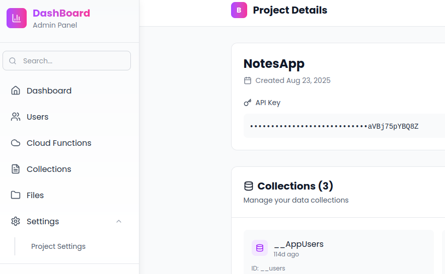

# Google OAuth Authentication

This feature allows your application users to sign in using their Google accounts through OAuth 2.0 authentication flow.

## Prerequisites

Before implementing Google OAuth, you need to:

1. **Set up Google OAuth credentials:**

   - Go to [Google Cloud Console](https://console.cloud.google.com/)
   - Create a new project or select an existing one
   - Enable the Google+ API
   - Go to "Credentials" → "Create Credentials" → "OAuth 2.0 Client IDs"
   - Set your application type and authorized redirect URIs

2. **Configure your project settings** with the following required keys:
   - `GOOGLE_CLIENT_ID`: Your Google OAuth client ID
   - `GOOGLE_CLIENT_SECRET`: Your Google OAuth client secret
   - `GOOGLE_REDIRECT_URL`: The redirect URL registered in Google Console
   - `GOOGLE_COMPLETE_URL`: The URL where users are redirected after authentication

## Configuration

Add the following configuration keys to your project config:

```json
{
  "GOOGLE_CLIENT_ID": "your-google-client-id.apps.googleusercontent.com",
  "GOOGLE_CLIENT_SECRET": "your-google-client-secret",
  "GOOGLE_REDIRECT_URL": "https://api.cocobase.buzz/auth-google-redirect/{project_id}",
  //Replace the project id with your actuall project id
  // Also use this redirect url on ur google oauth redirect url
  // Change the redirect url if you want to handle the authentication yourself
  "GOOGLE_COMPLETE_URL": "https://yourdomain.com/auth-complete"
}
```

You can fing project settings on the side navigation under the settings drop down



### Configuration Parameters

| Parameter              | Type   | Required | Description                                                  |
| ---------------------- | ------ | -------- | ------------------------------------------------------------ |
| `GOOGLE_CLIENT_ID`     | string | Yes      | OAuth client ID from Google Cloud Console                    |
| `GOOGLE_CLIENT_SECRET` | string | Yes      | OAuth client secret from Google Cloud Console                |
| `GOOGLE_REDIRECT_URL`  | string | Yes      | Callback URL after Google authentication (our server)        |
| `GOOGLE_COMPLETE_URL`  | string | Yes      | Final redirect URL after processing (your server or website) |

## API Endpoints

### 1. Initiate Google Login

**Endpoint:** `GET /login-google`

Generates the Google OAuth URL for user authentication.

**Response:**

```json
{
  "url": "https://accounts.google.com/oauth/authorize?client_id=...&redirect_uri=..."
}
```

**Usage Example:**

```javascript
// Redirect user to Google login
fetch("https://api.cocobase.buzz/auth-collections/login-google")
  .then((response) => response.json())
  .then((data) => {
    window.location.href = data.url;
  });
```

### 2. Google OAuth Callback

**Endpoint:** `GET https://api.cocobase.buzz/auth-collections/auth-google-redirect/{project_id}`

Handles the callback from Google OAuth and processes user authentication.

**Parameters:**

- `code`: Authorization code from Google (query parameter)
- `project_id`: Your project ID (path parameter)

**Possible Redirects:**

| Scenario                               | Redirect URL                                                              |
| -------------------------------------- | ------------------------------------------------------------------------- |
| Success (existing user)                | `{GOOGLE_COMPLETE_URL}?coco-super-token={access_token}`                   |
| Success (new user)                     | `{GOOGLE_COMPLETE_URL}?coco-super-token={access_token}`                   |
| Invalid authorization code             | `{GOOGLE_COMPLETE_URL}?coco-error=invalid_authorization_code`             |
| Failed to get user info                | `{GOOGLE_COMPLETE_URL}?coco-error=failed_to_get_user_info`                |
| No email provided                      | `{GOOGLE_COMPLETE_URL}?coco-error=no_email_provided`                      |
| Email already registered with password | `{GOOGLE_COMPLETE_URL}?coco-error=email_already_registered_with_password` |
| Database error                         | `{GOOGLE_COMPLETE_URL}?coco-error=database_error`                         |
| Authentication failed                  | `{GOOGLE_COMPLETE_URL}?coco-error=authentication_failed`                  |

## User Flow

1. **User clicks "Sign in with Google"** → Your app calls `/login-google`
2. **User is redirected to Google** → User authenticates with Google
3. **Google redirects back** → User is sent to `/auth-google-redirect/{project_id}` with authorization code
4. **Server processes authentication** → Exchanges code for user info
5. **User is created or logged in** → Redirected to `GOOGLE_COMPLETE_URL` with token or error

## User Management

### New Users

When a user signs in with Google for the first time:

- A new `AppUser` record is created
- `oauth_id` is set to Google's user ID (`sub` field)
- `email` is set from Google profile
- `password` is set to the email (for internal use)
- `data.username` is generated from Google name or falls back to truncated user ID

### Existing Users

For users who already exist in the system:

- **OAuth users**: Successfully logged in with new token
- **Password users**: Prevented from using OAuth (returns error)

## Error Handling

The system handles various error scenarios gracefully:

### Client-Side Error Handling

```javascript
// Handle the callback on your complete page
const urlParams = new URLSearchParams(window.location.search);
const token = urlParams.get("coco-super-token");
const error = urlParams.get("coco-error");

if (token) {
  // Store token and proceed with authenticated flow
  localStorage.setItem("auth_token", token);
  // Redirect to dashboard or main app
} else if (error) {
  // Handle specific errors
  switch (error) {
    case "email_already_registered_with_password":
      alert("This email is already registered. Please use password login.");
      break;
    case "invalid_authorization_code":
      alert("Authentication failed. Please try again.");
      break;
    // Handle other error cases
  }
}
```

## Security Considerations

- **Email Validation**: Only users with verified Google emails can authenticate
- **OAuth ID Verification**: Users are linked to their Google account via `oauth_id`
- **Mixed Authentication Prevention**: Users who registered with passwords cannot use OAuth
- **Token Security**: Access tokens are generated securely for authenticated users

## Implementation Example

### Frontend Integration

```html
<!DOCTYPE html>
<html>
  <head>
    <title>Google OAuth Login</title>
  </head>
  <body>
    <button id="googleLogin">Sign in with Google</button>

    <script>
      document
        .getElementById("googleLogin")
        .addEventListener("click", async () => {
          try {
            const response = await fetch("/login-google");
            const data = await response.json();
            window.location.href = data.url;
          } catch (error) {
            console.error("Login failed:", error);
          }
        });
    </script>
  </body>
</html>
```

### Completion Page Handler

```javascript
// On your GOOGLE_COMPLETE_URL page
function handleAuthCallback() {
  const urlParams = new URLSearchParams(window.location.search);
  const token = urlParams.get("coco-super-token");
  const error = urlParams.get("error");

  if (token) {
    // Success - store token and redirect
    sessionStorage.setItem("auth_token", token);
    // OR if you are using the cocobase package simply set the cocobase auth token
    window.location.href = "/dashboard";
  } else if (error) {
    // Handle error
    displayError(error);
  }
}

// Call on page load
handleAuthCallback();
```

## Troubleshooting

### Common Issues

1. **"GOOGLE_CLIENT_ID key missing"**

   - Ensure you've added the client ID to your project configuration

2. **"GOOGLE_REDIRECT_URL key missing"**

   - Verify the redirect URL is configured and matches Google Console settings

3. **"Invalid authorization code"**

   - Check that your redirect URI exactly matches the one registered in Google Console

4. **"Email already registered with password"**

   - User must use regular password login instead of OAuth

5. **"Failed to get user info"**
   - Verify your Google+ API is enabled and credentials are correct

### Debug Tips

- Check server logs for detailed error messages
- Verify all configuration keys are properly set
- Ensure the CocoBase redirect URL (from your console) is added to Google Cloud Console authorized redirect URIs
- Test with different Google accounts to verify the flow
